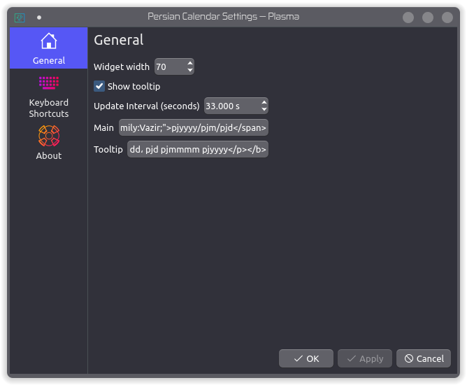

# Persian Calendar

A simple KDE Plasma widget for Persian date (a.k.a [Jalali calendar](https://en.wikipedia.org/wiki/Jalali_calendar)).

[Link to KDE store](https://store.kde.org/p/1407451/).


*Latest Release: v1.3.0 `[2020-08-28]`*

[Change history](./CHANGELOG.md)

## Customization

Some of HTML tags and CSS stylings are supported. For date and time formatting see [here](https://github.com/yousefvand/persian-date-parser#masks).



Default style for main text:

```html
<span style="font-size:0.875em;font-family:Vazir;">pjyyyy/pjmm/pjdd</span>
```

Default style for tooltip text:

```html
<b><p style="font-family:Vazir;font-size:0.875em;text-align:center;">gdddd, gd gmmmm gyyyy<br/>pjdddd، pjd pjmmmm pjyyyy</p></b>
```

Share your styles by making a pull request to [this](STYLES) file.

## Installing from source

```bash
git clone https://github.com/yousefvand/plasmoid-persian-calendar.git
cd plasmoid-persian-calendar
./manage.sh --build
# Replace VERSION according to your build
kpackagetool5 -t Plasma/Applet --install persian-calendar.VERSION.plasmoid
```

## Acknowledgements

This software uses:

- [Jalali calendar algorithm](https://jdf.scr.ir/jdf/?t=java_script) by [jdf.scr.ir](http://jdf.scr.ir/jdf)
- [Vazir font](https://github.com/rastikerdar/vazir-font) by [Saber Rastikerdar](https://github.com/rastikerdar)
