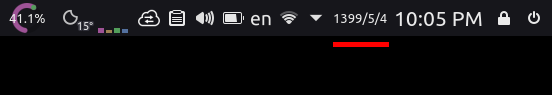

# Persian Calendar

[](https://github.com/yousefvand/plasmoid-persian-calendar/releases) [](https://github.com/yousefvand/plasmoid-persian-calendar/issues) [](http://isitmaintained.com/project/yousefvand/plasmoid-persian-calendar "Average time to resolve an issue") [](https://github.com/yousefvand/plasmoid-persian-calendar/stargazers) [](https://github.com/yousefvand/plasmoid-persian-calendar/network) [](https://github.com/yousefvand/persian-date-parser) [](https://github.com/yousefvand/plasmoid-persian-calendar/blob/master/LICENSE)

A simple KDE Plasma widget for Persian date (a.k.a [Jalali calendar](https://en.wikipedia.org/wiki/Jalali_calendar)) available at [KDE store](https://www.pling.com/p/2165655/).



## Customization

Some of HTML tags and CSS stylings are supported. For date and time formatting check [here](https://github.com/yousefvand/persian-date-parser#masks).

Default style for main text:

```html
<span style="font-size:0.875em;font-family:Vazir;">pjyyyy/pjm/pjd</span>
```

Default style for tooltip text:

```html
<b><p style="font-family:Vazir;font-size:0.875em;text-align:center;">gdddd, gd gmmmm gyyyy<br/>pjdddd، pjd pjmmmm pjyyyy</p></b>
```

Share your styles by making a pull request to [this](STYLES) file.

## Installing from package file

Download the [latest release](https://github.com/yousefvand/plasmoid-persian-calendar/releases). Uninstall previous version if any, re-login and:

```bash
$ kpackagetool5 -t Plasma/Applet --install persian-calendar.v2.0.0.zip
```

Now widget is available for adding to panel(s).

## Acknowledgements

This software uses:

- [Jalali calendar algorithm](https://jdf.scr.ir/jdf/?t=java_script) by [jdf.scr.ir](http://jdf.scr.ir/jdf)
- [Vazir font](https://github.com/rastikerdar/vazir-font) by [Saber Rastikerdar](https://github.com/rastikerdar)

### [Change history](./CHANGELOG.md)
